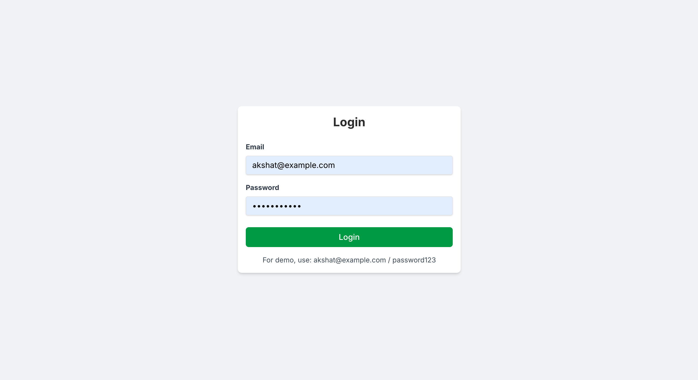
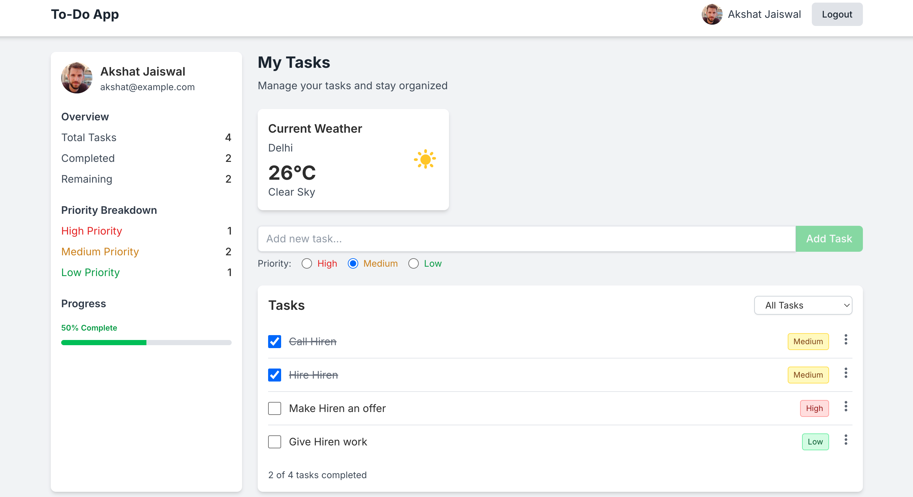

# Advanced React To-Do Application

This is an advanced React To-Do application with API integration, built using React, Redux, and modern web development techniques. The application allows users to manage tasks, set priorities, and includes user authentication.

## Features

- User authentication (login/logout)
- Task management (add, delete, update)
- Task prioritization (High, Medium, Low)
- Weather API integration
- Responsive design for mobile, tablet, and desktop
- Local storage for task persistence

## Tech Stack

- React (Functional Components & Hooks)
- Redux for state management
- Redux Thunk for async actions
- React Router for navigation
- TailwindCSS for styling
- Axios for API requests
- LocalStorage for data persistence

## Project Structure

The project follows a modular structure:

- `/src/components`: Reusable UI components
- `/src/pages`: Page components
- `/src/redux`: Redux actions, reducers, and store
- `/src/utils`: Utility functions
- `/src/styles`: CSS styles
- `/src/services`: API service integrations

## Getting Started

### Prerequisites

- Node.js and npm installed on your machine

### Installation

1. Clone the repository:
```bash
git clone https://github.com/yourusername/todo-app.git
cd todo-app
```

2. Install dependencies:
```bash
npm install
```

3. Create a `.env` file in the root directory and add your OpenWeatherMap API key:
```
REACT_APP_OPENWEATHERMAP_API_KEY=your_api_key_here
```

4. Start the development server:
```bash
npm start
```

5. Open [http://localhost:3000](http://localhost:3000) to view the application in your browser.

## Demo Credentials

For testing purposes, you can use the following credentials:

- Email: akshat@example.com
- Password: password123

## Deployment

To build the application for production:

```bash
npm run build
```

This will create an optimized production build in the `build` folder that can be deployed to any static hosting service like Netlify, Vercel, or GitHub Pages.

## Screenshots



